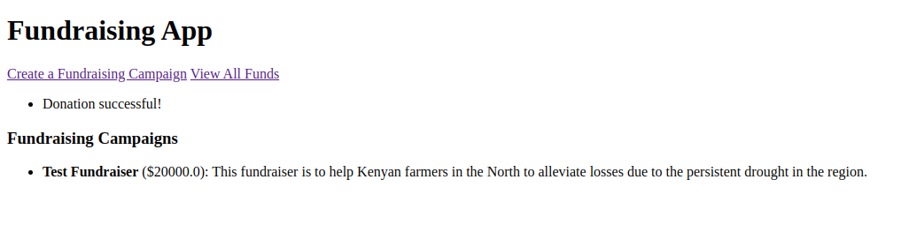

## About this project
This is an exercise to test creating products integrating with YellowCard's crypto APIs.
I wanted to create a social fundraiser POC where people can create fund-drive campagns and mobilize donations towards a goal.
I have created a simple app using Python Flask framework to test this workflow and usabilities of YC's APIs.

### Environment setup
To access YellowCard APIs, you need an api_key and a secret_key which should be saved in a .env file
1. Create a file named `.env` and save the keys there
```
API_KEY=<YELLOW_CARD_SANDBOX_API_KEY>
SECRET_KEY=<YELLOW_CARD_SANDBOX_SECRE_KEY>
```
2. Create and activate a `virtualenv`

3. Start the application. Inside the virtual environment, run
   ```sh
   python main.py
   ```
   and access the app on `http://127.0.0.1:5000/`
   
   
   
   `Fig. 1.0: App homepage`

5. Create a Fundraising campaign
   
  
  
  `Fig. 2.0: Fill in the Fundraiser details`
  
  
  
  `Fig. 2.1: Fundraiser added on the home page`

5. Receive donations: Navigate to View all funds and click Donate
   This uses YellowCard's
   * `/rates` API to get conversion rates for user's country, Kenya
   * `/channels` API to get *mobile money* payment channels in Kenya, filtered by active status and channelType type
   * `/collections` APIs to make a POST request and save the donation data
   
   The use case is to POST a collection request from the user's YellowCard wallet that will deposit onto the Fundraiser account
   whose details have been hard-coded in the recipient's data, towards achieving the fundraiser's goal.

  
  
  `Fig. 3.0: Fundraiser donation page`
  
  
  
  `Fig. 3.1: Fundraiser donation details`
  
  
  
  `Fig. 3.3: Successful donation`
  
  

  `Fig. 3.4: List of donations on a fundraiser.`

  * As higlighted on the challenges, I couldn't get the `POST /collections` working in order to complete the funds trasnfer due to
    `AuthenticationError` when generating valid key:signature from signed payload.
    ```sh
    {"code":"AuthenticationError","message":"invalid apiKey signature combination"}
    ```


6. Once the target is achieved, `Send Funds` Button actiavtes to allow one to send the raised amount to the recipient's account.
   

   `Fig. 4.0: Send raised donations to recipient's account`

   <p align="right">(<a href="#readme-top">back to top</a>)</p>

### Challenges faced.
1. From a developer's perspective, I found the API documentation missing information that would help me test the APIs faster.
   - I found myself stuck on getting any GET APIs working due to `Authntication error: invalid apiKey signature combination` even 
   after signing the message with the correct sequence according to the documentation. I tried in Node.js and Python with no luck and only got it working
   on Python after persisting for long. Mind you all the `recipes` are for POST requests only
   - The behavior is confusing where the example POST `recipe` for posting `payments` works, but updating the body's payload to post a `collection` makes it fail with the failed Authentication error
   - Constructing Post requests even when following the documentation on generating a signature is a nightmare due to the incosistent behaviors.
      - *I would improve the documentation to make it more interactive and with as much information as possible to reduce confusion,
        frustrations and improve user experiecne for a Developer going through te API for the first time*
2. The API documentation's on the API Reference page, is hard to test on the provided code samples due to the Authentication header 
   that needs one to generate a signed one from elsewhere and paste in the `header` section, meaning if one is not able to generate a valid key:signature combination
   they will never get the gist of how the APIs are working.
      - *I would improve the documentation with Developers in mind and provide comprehensive code examples to show how the different payloads are signed instead of needing them to paste from elsewhere.*
3. For a person who is not familiar with the product's ecosystem, the documentation doesn't make it easy for one to understand and differentiate payments from collections. 
   Upto now I am still not sure what payment is and how it differentiates from a collection.
      - *I would enhance the documentation with real user stories/use cases around each API usage to help people understand what payments or collections are.* 
<p align="right">(<a href="#readme-top">back to top</a>)</p>
